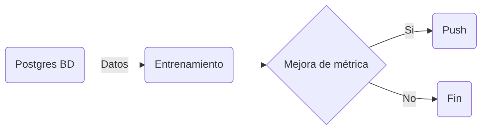

# mlops-forecasting-model-architecture

Se propone un infraestructura para entrenar modelos de Aprendizaje Automático

## Componentes

- __Orquestador__: 

- __Plataforma de Aprendizaje Automático__: 
